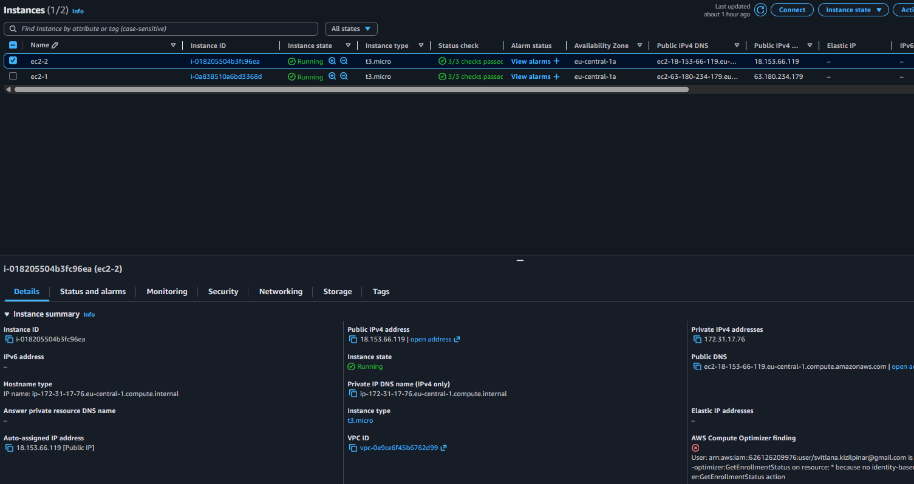
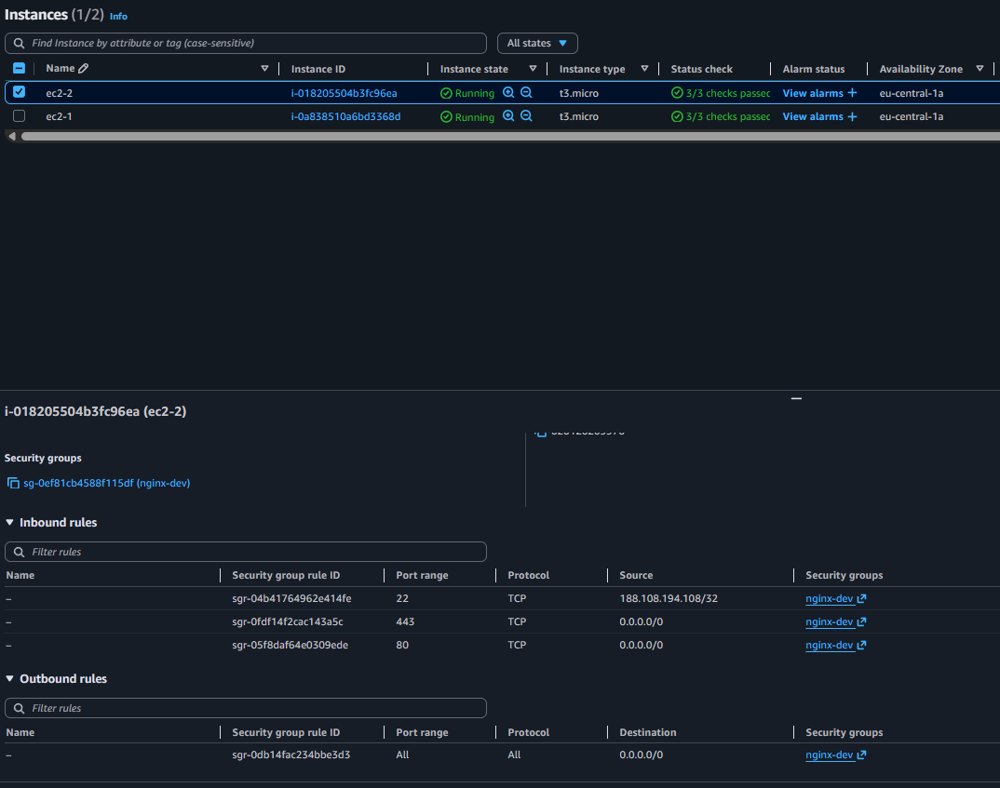
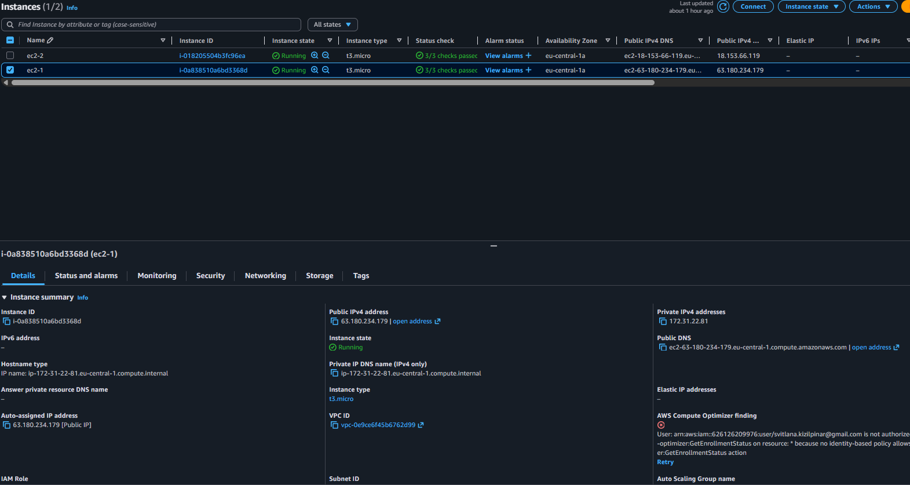
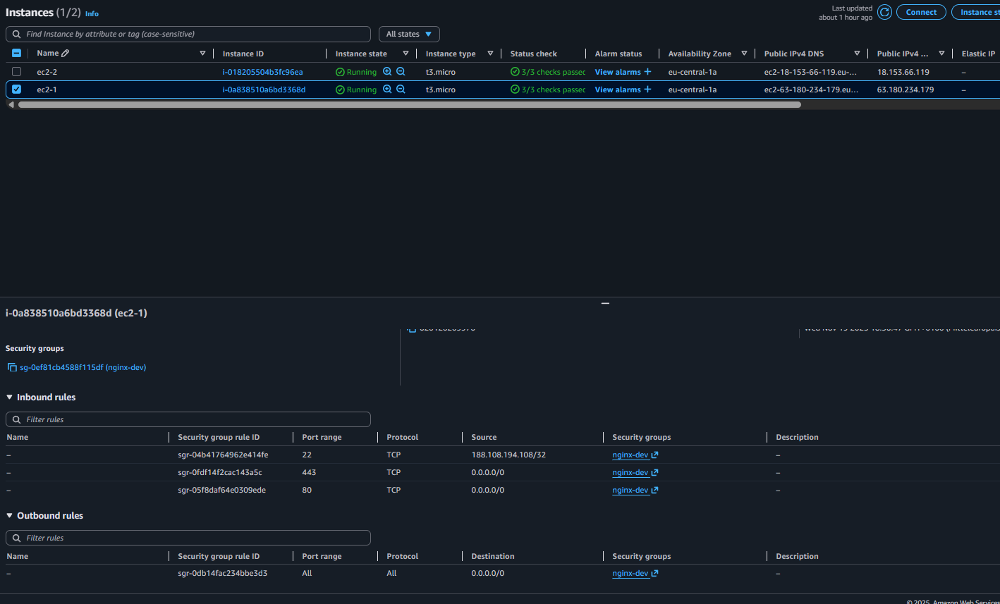
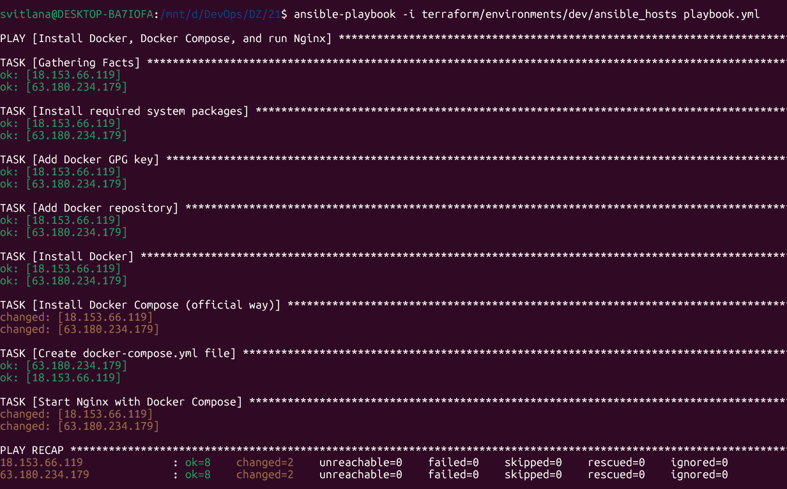
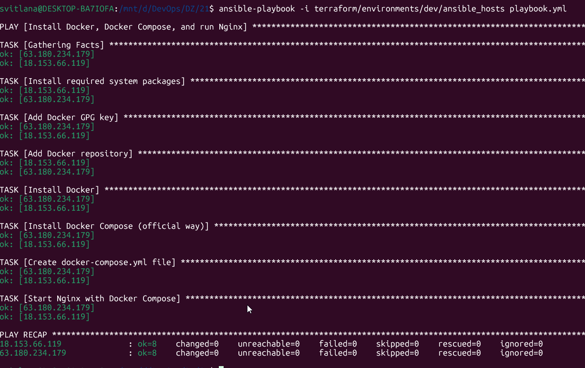
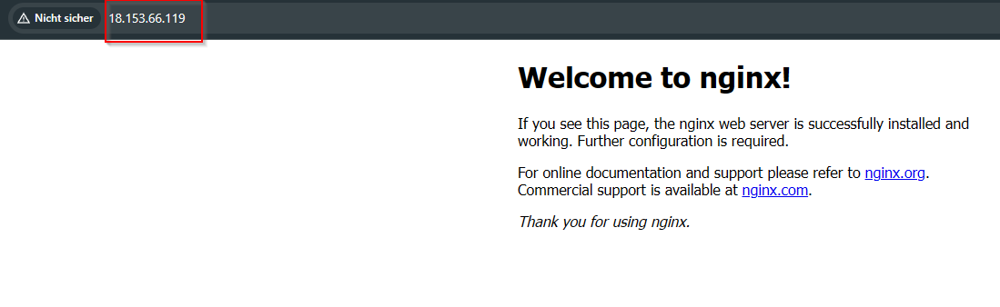
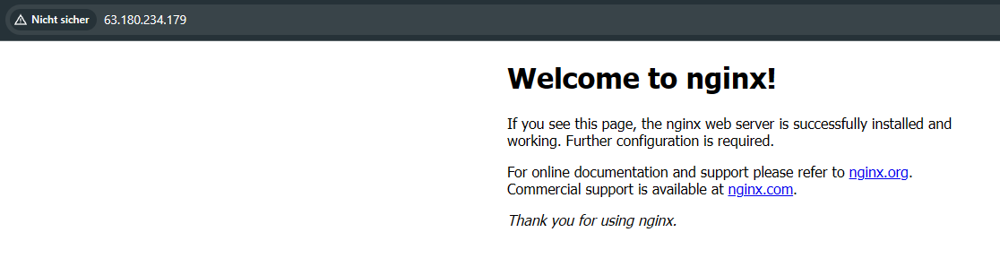
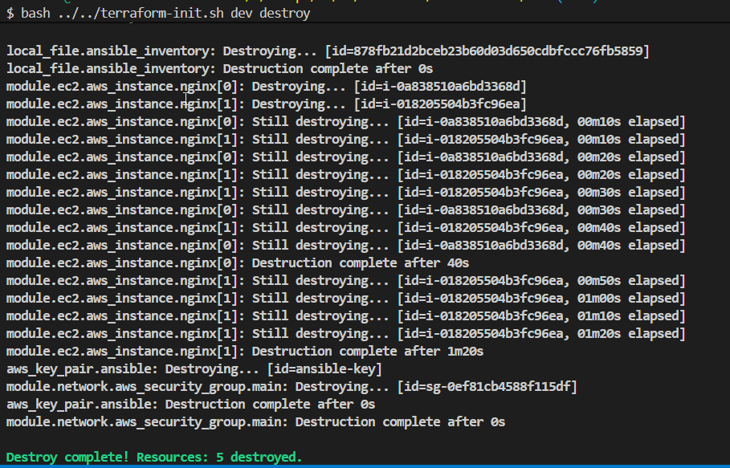

# AWS Terraform + Ansible Project

## Опис
Проект автоматично створює AWS інфраструктуру через Terraform та готує inventory-файл для Ansible:
- Security Group з відкритими портами (80, 443)
- Два EC2 інстанси Ubuntu (через count)
- S3 backend для стейту
- Модульна структура: network та ec2
- Автоматичний вибір VPC, Subnet, AMI через data sources
- Автоматичне створення Ansible inventory-файлу


## Структура проекту
```
├── Modules/
│   ├── ec2/
│   │   ├── ec2.tf
│   │   ├── variables.tf
│   │   ├── outputs.tf
│   ├── network/
│   │   ├── security_group.tf
│   │   ├── variables.tf
│   │   ├── outputs.tf
├── terraform/
│   ├── terraform-init.sh
│   ├── environments/
│   │   └── dev/
│   │       ├── main.tf
│   │       ├── data.tf
│   │       ├── variables.tf
│   │       ├── locals.tf
│   │       ├── dev.tfvars
│   │       ├── ansible_hosts.tpl
│   │       ├── ansible_hosts
├── playbook.yml
├── README.md
```

## 🧠 Що робить Terraform
- Використовує S3 backend:
   - bucket: terraform-state-danit10-devops
   - region: eu-central-1
   - key: sk-dev.tfstate
- Автоматично бере default VPC, public subnet, Ubuntu AMI.
- Модуль network створює Security Group:
   - порти 80, 443 → 0.0.0.0/0
   - порт 22 → ТІЛЬКИ мій external IP /32, визначений так:
      data "http" "my_ip" { url = "https://checkip.amazonaws.com" }
      locals { ssh_allowed_cidr = "${chomp(data.http.my_ip.response_body)}/32" }
- Модуль ec2 створює 2 EC2 (count = 2) та привʼязує ключ:
   resource "aws_key_pair" "ansible" { key_name = "ansible-key"; public_key = var.public_key_content }
- Повертає масив публічних IP:
   output "instance_public_ips" { value = [for i in aws_instance.nginx : i.public_ip] }
- Генерує Ansible inventory у ansible_hosts.

## 📋 Передумови

Перед початком переконайтеся, що у вас є:

- ✅ AWS аккаунт (безкоштовний tier підійде)
- ⏳ AWS CLI (встановимо в кроці 1)
- ⏳ Terraform (встановимо в кроці 2)
- ✅ Базове розуміння командного рядка
- ✅ Текстовий редактор (VS Code рекомендується)

## 🔐 Крок 1: Налаштування AWS доступу

**Мета**: Встановити AWS CLI і налаштувати безпечний доступ до AWS для Terraform

### 1.1 Встановлення AWS CLI

**Статус**: ✅ Завершено (aws-cli/2.31.32)

AWS CLI потрібен для взаємодії з AWS з командного рядка. Terraform використовує ті ж самі credentials.

**📋 Детальні інструкції**: [install-aws-cli.md](docs/install-aws-cli.md)  

**Швидке встановлення для Windows:**
1. Завантажте MSI installer: https://awscli.amazonaws.com/AWSCLIV2.msi
2. Запустіть installer → Перезапустіть термінал
3. Перевірте: `aws --version` (має показати aws-cli/2.31.32)

### 1.2 Проблема з правами доступу до S3

**❌ Проблема**: Початковий користувач AWS не мав прав для створення S3 bucket та роботи з Terraform backend.

**🔍 Причина**: У основного AWS користувача були обмежувальні політики (explicit deny), які блокували доступ до S3 сервісу.

**✅ Рішення**: Створити окремого користувача спеціально для Terraform з мінімальними необхідними правами.


## 🛠️ Крок 2: Встановлення Terraform

**Статус**: ✅ Завершено (Terraform v1.13.5)

**Мета**: Встановити Terraform для керування інфраструктурою як код (IaC)

**📋 Детальні інструкції**: [install-terraform.md](docs/install-terraform.md)

**Швидке встановлення:**
1. Завантажити з https://www.terraform.io/downloads.html
2. Розпакувати і додати до PATH
3. Або через winget: `winget install Hashicorp.Terraform`
4. Перевірити: `terraform --version` (має показати v1.13.5)

## Налаштування AWS користувача
1. Створіть IAM користувача з ім'ям `sk-terraform-user`. **📋 Детальні інструкції**: [create-terraform-user.md](docs/create-terraform-user.md)
2. Згенеруйте для нього Access Key та Secret Key (**📋 Налаштування credentials**: [aws-credentials-setup.md](docs/aws-credentials-setup.md)).
3. Додайте користувачу такі права:
   - `AmazonEC2FullAccess`
   - Кастомна політика `S3AccessOnlyToSvitlanaKizilpinarBucket` ([детальніше про EC2 політики](docs/add-ec2-permissions.md)).
4. Не створюйте новий S3 bucket! Використовуйте вже наданий bucket: `terraform-state-danit10-devops` (region: eu-central-1).

## S3 Backend
Для збереження стейту використовується S3 bucket (налаштування у terraform.tf).

## Автоматичний вибір ресурсів
Всі ID VPC, Subnet, AMI підтягуються автоматично через data sources у data.tf.

## Змінні
Всі змінні для середовища зберігаються у dev.tfvars.

## Модулі
- network: створює security group
- ec2: створює дві EC2 інстанс

## 🚀 Як це працює
1. Перейдіть у папку середовища:
   ```bash
   cd terraform/environments/dev
   ```
2. Запустіть створення інфраструктури:
   ```bash
   bash ../../terraform-init.sh dev plan
   bash ../../terraform-init.sh dev apply
   ```
3. Після виконання у папці зʼявиться файл `ansible_hosts` з IP-адресами EC2:
   ```
   [nginx]
   63.180.234.179
   18.153.66.119

   [nginx:vars]
   ansible_user=ubuntu
   ansible_ssh_private_key_file=~/.ssh/id_rsa (див. SSH та Ansible через Ubuntu (WSL)!!!)
   ```
4. Запустіть Ansible playbook для встановлення Docker, Docker Compose, запуску Nginx:
   ```bash
   ansible-playbook -i terraform/environments/dev/ansible_hosts playbook.yml
   ```
5. Перевірте доступ до Nginx через браузер за публічними IP EC2.

## 🔐 SSH та Ansible через Ubuntu (WSL)
### 1️⃣ Копіювання SSH-ключів у Ubuntu
У Windows ключі:
C:\Users\Svitlana\.ssh\id_rsa
C:\Users\Svitlana\.ssh\id_rsa.pub

У WSL (Ubuntu) виконати:
mkdir -p ~/.ssh
cp /mnt/c/Users/Svitlana/.ssh/id_rsa ~/.ssh/id_rsa
cp /mnt/c/Users/Svitlana/.ssh/id_rsa.pub ~/.ssh/id_rsa.pub
chmod 600 ~/.ssh/id_rsa

### 2️⃣ Перевірка SSH підключення
ssh -i ~/.ssh/id_rsa ubuntu@<PUBLIC_IP>

### 3️⃣ Ansible inventory шаблон
У terraform/environments/dev/ansible_hosts.tpl:

[nginx]
${ec2_ips}

[nginx:vars]
ansible_user=ubuntu
ansible_ssh_private_key_file=~/.ssh/id_rsa

### 4️⃣ Готовий файл після terraform apply
[nginx]
63.180.234.179
18.153.66.119

[nginx:vars]
ansible_user=ubuntu
ansible_ssh_private_key_file=~/.ssh/id_rsa

### 5️⃣ Запуск Ansible
ansible-playbook -i terraform/environments/dev/ansible_hosts playbook.yml

## Основні зміни
- Використовується S3 backend для збереження стейту (bucket: terraform-state-danit10-devops, region: eu-central-1)
- Автоматично вибирається default VPC, public subnet, Ubuntu AMI через data sources
- Модуль network створює Security Group:
   - порти 80, 443 відкриті для всіх (0.0.0.0/0)
   - порт 22 відкритий тільки для твого зовнішнього IP (визначається через data "http" "my_ip")
- Модуль ec2 створює 2 EC2 (count = 2) та привʼязує SSH-ключ (aws_key_pair)
- Публічні IP EC2 повертаються як масив через output
- Генерується Ansible inventory-файл ansible_hosts з IP EC2
- Весь процес автоматизовано через скрипт terraform-init.sh

## 🧹 Видалення інфраструктури

## Видалення ресурсів
Для видалення інфраструктури використовуйте:
```bash
bash ../../terraform-init.sh dev destroy
```

### ⚠️ **ЗАЛИШИЛОСЬ ВИДАЛИТИ ВРУЧНУ:**

**👤 IAM Користувач:**
1. Відкрийте [AWS IAM Console](https://console.aws.amazon.com/iam/)
2. Users → `sk-terraform-user`
3. Security credentials → Delete Access Keys
4. Delete User

**🔑 Локальні AWS credentials:**
```bash
aws configure list-profiles
# Видаліть профіль sk-terraform-user з ~/.aws/credentials та ~/.aws/config
```

**Після цього AWS аккаунт буде повністю очищений!** 🧹

## Результати виконання
Нижче наведені скріншоти, що демонструють успішне створення інфраструктури та доступ до Nginx:

| №     | Опис                                    | Скриншот                                                   |
|-------|-----------------------------------------|------------------------------------------------------------|
| 7.1   | EC2_2 інстанс у AWS Console             |                        |
| 7.2   | Security Group для EC2                  |                  |
| 7.3   | EC2_1 інстанс у AWS Console             |                        |
| 7.4   | Security Group для EC2                  |                  |
| 7.5   | Запуск Ansible playbook (перший сервер) |                |
| 7.6   | Запуск Ansible playbook (другий сервер) |                |
| 7.7   | Доступ до Nginx на EC2_1 через браузер  |                  |
| 7.8   | Доступ до Nginx на EC2_2 через браузер  |                  |
| 8.1   | Terraform destroy                       |     |


## 📚 Корисні посилання
- [Terraform AWS Provider](https://registry.terraform.io/providers/hashicorp/aws/latest/docs)
- [Terraform Documentation](https://www.terraform.io/docs/)
- [AWS Free Tier](https://aws.amazon.com/free/)

### Додаткова документація
- [IAM User Creation](https://docs.aws.amazon.com/IAM/latest/UserGuide/id_users_create.html)
- [How to Attach Policies to IAM User](https://docs.aws.amazon.com/IAM/latest/UserGuide/access_policies_manage-attach-detach.html)
- [AmazonEC2FullAccess Policy](https://docs.aws.amazon.com/AWSEC2/latest/UserGuide/iam-roles-for-amazon-ec2.html)
- [Terraform S3 Backend](https://developer.hashicorp.com/terraform/language/settings/backends/s3)


