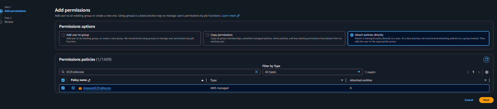
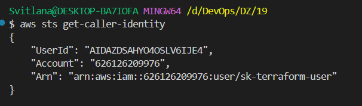

# Додавання EC2 політики до користувача sk-terraform-user

## Крок 1: Перехід до IAM Users
1. Відкрийте AWS консоль: https://console.aws.amazon.com/
2. У пошуку знайдіть "IAM" і перейдіть до сервісу
3. У лівому меню виберіть "Users"
4. Знайдіть користувача `sk-terraform-user` і клікніть на нього

## Крок 2: Додавання політики
1. На сторінці користувача перейдіть до вкладки "Permissions"
2. Клікніть на кнопку "Add permissions"
3. Виберіть "Attach policies directly"

## Крок 3: Пошук та вибір політики EC2FullAccess
1. У полі пошуку введіть "EC2FullAccess"
2. Знайдіть політику "AmazonEC2FullAccess"
3. Поставте галочку біля цієї політики
4. Клікніть "Next"

## Крок 4: Підтвердження
1. Перевірте, що вибрано політику AmazonEC2FullAccess
2. Клікніть "Add permissions"

## Крок 5: Перевірка результату
Після успішного додавання політики ви побачите її у списку політик користувача.

**📸 СКРІНШОТ 5**: Список політик користувача з новою AmazonEC2FullAccess



---

---

## Крок 6: Перевірка роботи в VS Code
Після додавання політики повертайтеся до VS Code та виконайте:

### 1. Налаштуйте AWS профіль (якщо не зроблено):
```bash
export AWS_PROFILE=sk-terraform-user
# або на Windows:
set AWS_PROFILE=sk-terraform-user
```

### 2. Перевірте доступ:
```bash
aws sts get-caller-identity
```

### 3. Запустіть Terraform:
```bash
terraform plan
```

**📸 СКРІНШОТ 6**: Успішний результат після налаштування профілю та запуску terraform



**Результат**: Terraform тепер має доступ до EC2 API для отримання списку availability zones та створення інфраструктури! ✅