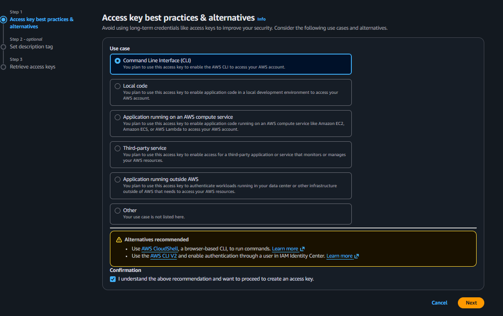
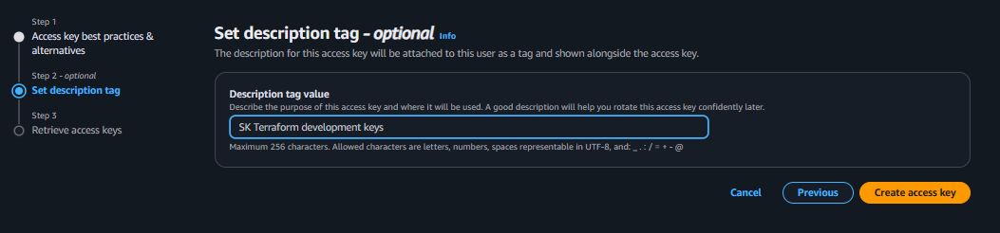
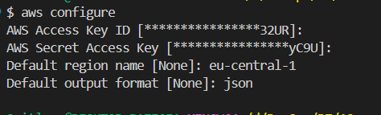

# 🔐 Налаштування AWS Credentials - Покрокова інструкція

## Що таке AWS Credentials?

AWS Credentials - це ваші "ключі доступу" до AWS аккаунта. Вони складаються з:
- **Access Key ID** - публічна частина (як логін)
- **Secret Access Key** - приватна частина (як пароль)

## Крок 1: Перевірка та створення IAM користувача

1. **Увійдіть в AWS Management Console**: https://console.aws.amazon.com/

2. **Перейдіть до IAM сервісу**:
   - У пошуку введіть "IAM" та натисніть на сервіс

3. **Перевірте чи є у вас IAM користувач**:
   - Натисніть "Users" в лівому меню
   - Якщо вже є користувач для розробки - можете використати його
   - Якщо немає або хочете створити окремого для Terraform - переходьте до наступного кроку

4. **Створіть нового користувача** (якщо потрібно):
   - Натисніть "Create user"
   - Введіть ім'я користувача (наприклад, `sk-terraform-user`)

## Крок 2: Створення Access Keys

### 2.1 Початок створення ключів
1. **Перейдіть на вкладку "Security credentials"** вашого користувача
2. **Натисніть "Create access key"** (синя кнопка)


### 2.2 Вибір призначення
1. **Оберіть "Command Line Interface (CLI)"**
2. **Поставте галочку** що ви розумієте рекомендації 
3. **Натисніть "Next"**



### 2.3 Додавання опису
1. **Введіть опис** (наприклад: "Terraform development keys")
2. **Натисніть "Create access key"**



### 2.4 Збереження ключів
1. **Скопіюйте Access Key ID**
2. **Скопіюйте Secret Access Key** (показується тільки один раз!)
3. **Натисніть "Done"** після збереження



## Крок 3: 🔒 КРИТИЧНО ВАЖЛИВО - Безпека ключів

⚠️ **УВАГА**:
- **Secret Access Key показується тільки ОДИН РАЗ!**
- Обов'язково збережіть обидва ключі в безпечному місці
- Якщо втратите Secret Key, доведеться створювати нові ключі
- Ніколи не публікуйте ключі в git або публічних місцях

## Крок 5: Налаштування AWS CLI

Після встановлення AWS CLI запустіть:

```bash
aws configure
```

Введіть:
- **AWS Access Key ID**: [ваш Access Key ID]
- **AWS Secret Access Key**: [ваш Secret Access Key]  
- **Default region name**: eu-central-1 (або інший регіон)
- **Default output format**: json

## Крок 6: Перевірка налаштувань

```bash
# Перевірити поточного користувача
aws sts get-caller-identity

# Перевірити список регіонів (тест доступу)
aws ec2 describe-regions --output table
```

## 🛡️ Безпека:
- Ніколи не додавайте credentials у git репозиторій
- Використовуйте різні ключі для різних проектів
- Регулярно ротуйте (змінюйте) ключі
- Видаляйте невикористані ключі

---

**Наступний крок**: Після налаштування credentials ми створимо базову Terraform конфігурацію.