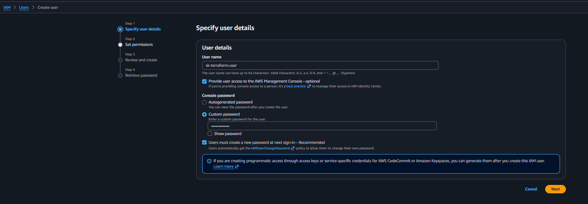
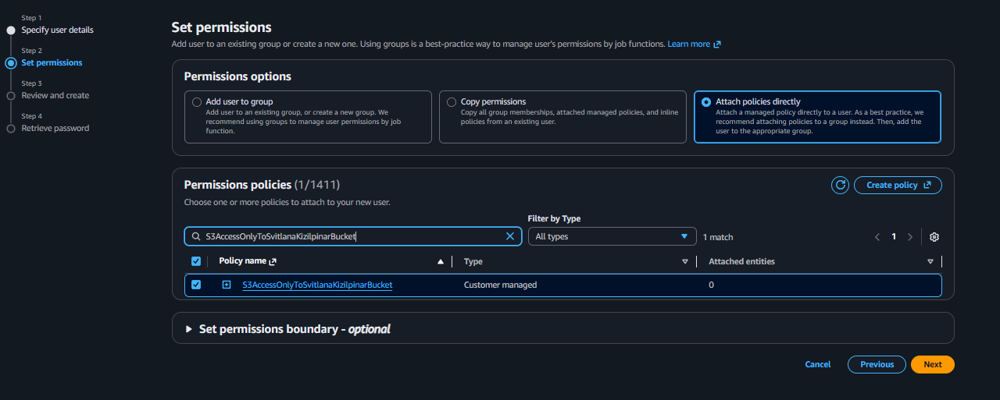
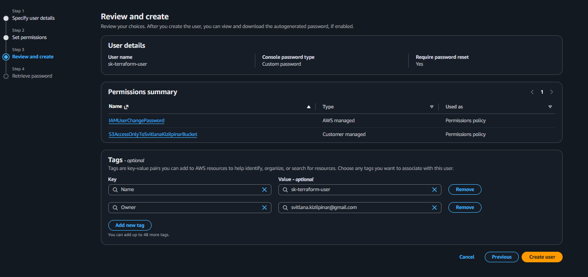
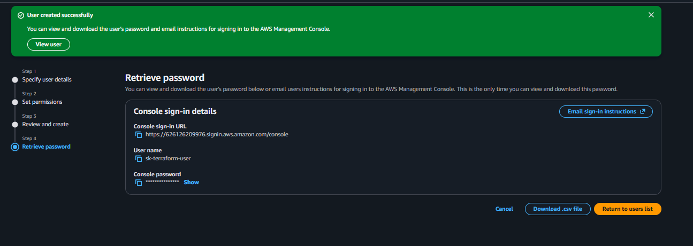
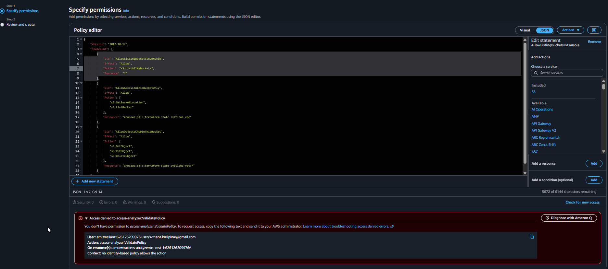
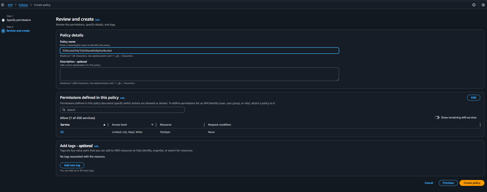
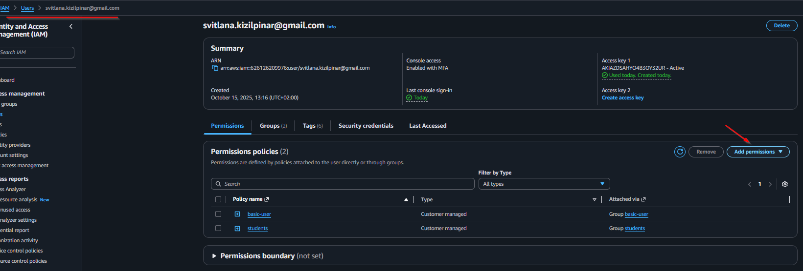
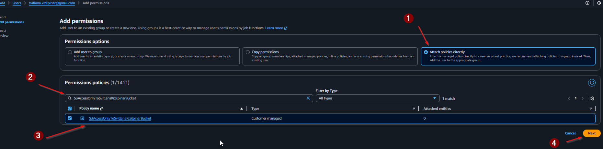
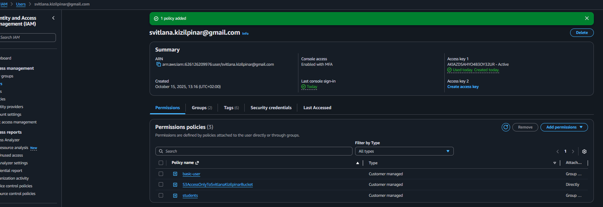

# 👤 Створення нового IAM користувача для Terraform

## 🎯 Чому новий користувач?

**Проблема з поточним користувачем:**
- Є explicit deny політики які блокують S3 доступ
- Обмежувальні політики students/basic-user
- Складно визначити джерело блокування

**Рішення:**
Створити чистого користувача спеціально для Terraform

## 📋 Покрокова інструкція

### Крок 1: Створення користувача

#### 1.1 Початок створення користувача
1. **AWS Console** → Пошук **"IAM"** → IAM сервіс
2. **Users** → **Create user**



#### 1.2 Налаштування користувача
1. **User name**: `sk-terraform-user`
2. **Provide user access to the AWS Management Console**: можете не ставити галочку (нам потрібен тільки програмний доступ)
3. **Next**



#### 1.3 Налаштування прав доступу
1. **Set permissions options**: Оберіть **"Attach policies directly"**
2. **Next**



#### 1.4 Створення користувача
1. **Review** налаштування
2. **Create user**



### Крок 2: Створення політики доступу

#### 2.1 Створення IAM Policy
1. **IAM** → **Policies** → **Create policy**
2. **JSON** таб → Вставити політику:

```json
{
	"Version": "2012-10-17",
	"Statement": [
		{
			"Sid": "AllowListingBucketsInConsole",
			"Effect": "Allow",
			"Action": "s3:ListAllMyBuckets",
			"Resource": "*"
		},
		{
			"Sid": "AllowAccessToThisBucketOnly",
			"Effect": "Allow",
			"Action": [
				"s3:GetBucketLocation",
				"s3:ListBucket"
			],
			"Resource": "arn:aws:s3:::terraform-state-danit10-devops"
		},
		{
			"Sid": "AllowObjectsCRUDInThisBucket",
			"Effect": "Allow",
			"Action": [
				"s3:GetObject",
				"s3:PutObject",
				"s3:DeleteObject"
			],
			"Resource": "arn:aws:s3:::terraform-state-danit10-devops/*"
		}
	]
}
```



#### 2.2 Налаштування політики
1. Назвіть політику: `S3AccessOnlyToSvitlanaKizilpinarBucket`
2. Додайте опис: `Доступ тільки до S3 bucket для Terraform backend`
3. **Next**



### Крок 3: Прикріплення політики до користувача

#### 3.1 Додавання прав користувачу
1. **IAM** → **Users** → `sk-terraform-user`
2. **Permissions** → **Add permissions**



#### 3.2 Вибір політики
1. **Attach policies directly**
2. Знайти створену політику
3. **Next**



#### 3.3 Результат


### Крок 4: Надання прав доступу (альтернатива)

**Варіант 1: Прикріпити готову політику (простіше)**
1. **Attach existing policies directly**
2. Знайдіть і оберіть:
   - ✅ `AmazonS3FullAccess`
   - ✅ `AmazonEC2FullAccess` 
   - ✅ `AmazonVPCFullAccess`
   - ✅ `IAMReadOnlyAccess` (для отримання інформації)

**Варіант 2: Створити мінімальну політику (безпечніше)**
Прикріпити тільки нашу політику `S3AccessOnlyToSvitlanaKizilpinarBucket` + додати політики для EC2/VPC

### Крок 3: Теги (опціонально)
- Key: `Purpose`, Value: `Terraform`
- Key: `Project`, Value: `VPC-Exercise`

### Крок 4: Перевірка та створення
1. **Review** всі налаштування
2. **Create user**

### Крок 5: Збереження credentials
⚠️ **КРИТИЧНО ВАЖЛИВО**:
1. **Завантажте .csv файл** з credentials
2. **Скопіюйте Access Key ID та Secret Access Key**
3. **Збережіть у безпечному місці**
4. **Secret Key показується тільки один раз!**

## 🔧 Налаштування AWS CLI для нового користувача

### Варіант 1: Новий профіль (рекомендую)
```bash
aws configure --profile sk-terraform-user
```
Введіть:
- **Access Key ID**: [з нового користувача]
- **Secret Access Key**: [з нового користувача]
- **Default region**: eu-central-1
- **Output format**: json

### Варіант 2: Замінити default профіль
```bash
aws configure
```

## ✅ Перевірка роботи

### Тест доступу:
```bash
# Якщо використовуєте профіль:
aws --profile sk-terraform-user s3 ls

# Якщо замінили default:
aws s3 ls
```

### Тест S3 bucket:
```bash
aws --profile sk-terraform-user s3api head-bucket --bucket terraform-state-svitlana-vpc
```

## 🔄 Оновлення Terraform

Після налаштування нового користувача:
1. `terraform init -migrate-state`
2. Продовжити з VPC створенням

## 🛡️ Безпека

**Після завершення проекту:**
- Деактивувати Access Keys старого користувача
- Видалити тестового користувача `sk-terraform-user`
- Видалити S3 bucket якщо не потрібен

---

**Готові створювати нового користувача?** 🚀